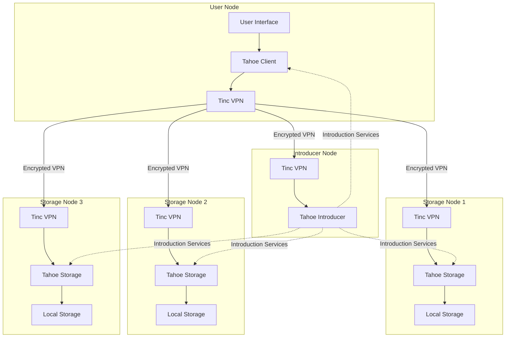
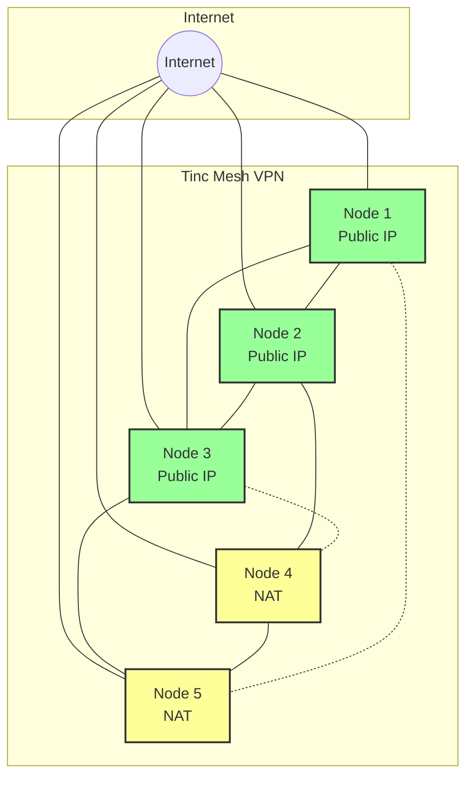
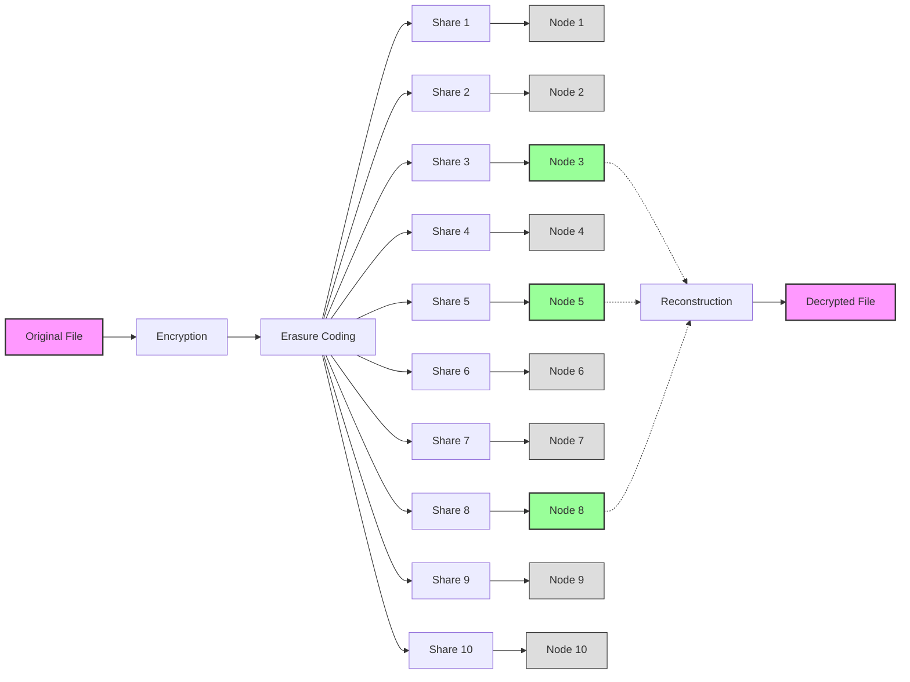
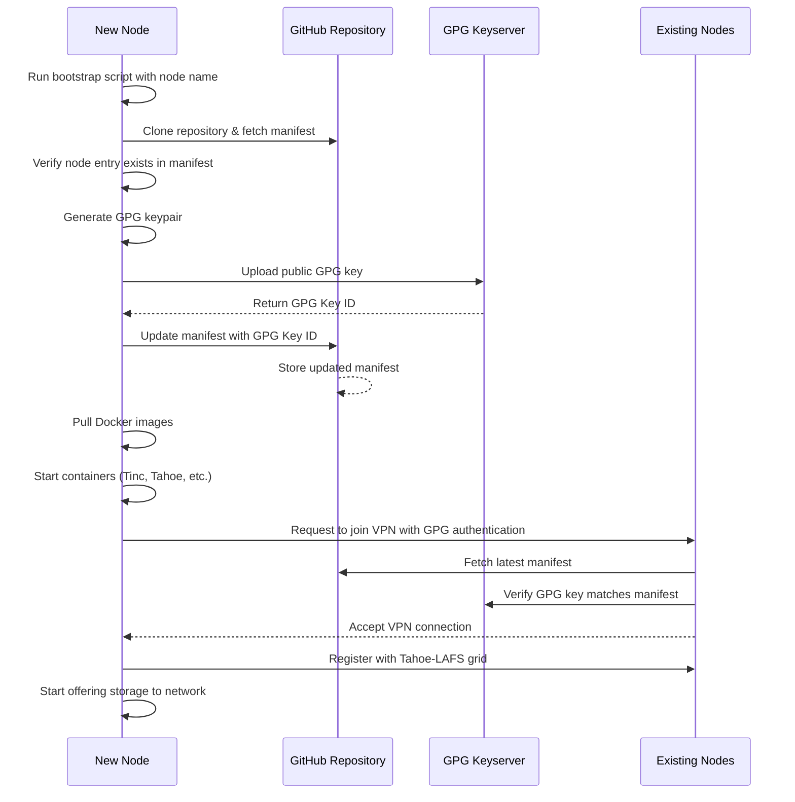
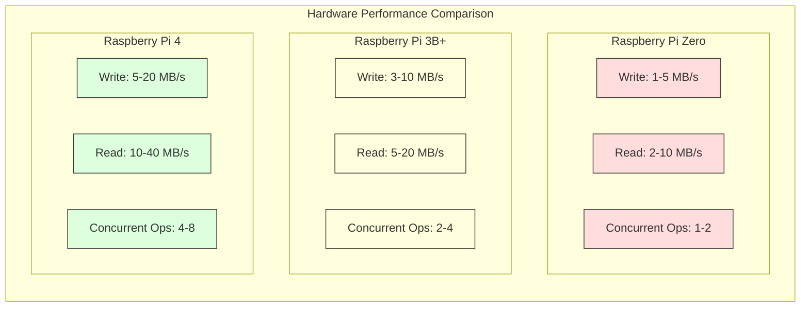
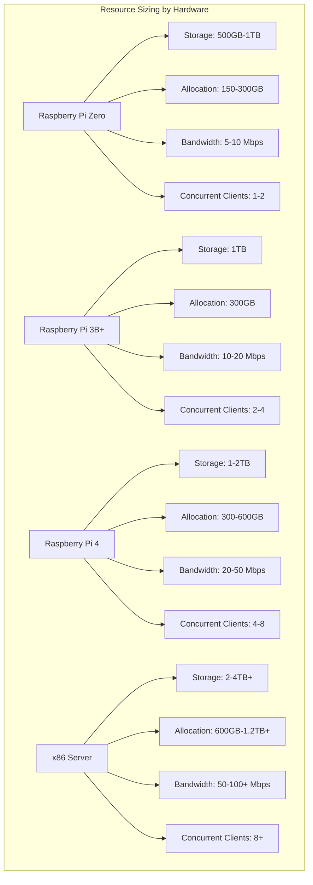

# Project Earthgrid: Distributed Storage System Design Document

## 1. Executive Summary

Project Earthgrid is a distributed, encrypted storage system built on Tahoe-LAFS (Least-Authority File System) that leverages user-contributed resources to create a highly resilient and private storage network. Users contribute computational resources (Raspberry Pi or similar hardware) and storage space (ideally 1TB) to the network, and in return receive 300GB of secure, distributed storage capacity. All data is encrypted client-side and distributed across the network using erasure coding, ensuring that files remain accessible even when multiple nodes are offline. The network connectivity between nodes is provided by Tinc, a mesh VPN that enables secure peer-to-peer connections.

### Key Features
- **Decentralized Architecture**: No central authority or single point of failure
- **End-to-End Encryption**: Data is encrypted before leaving the user's device
- **High Redundancy**: 3-of-10 erasure coding scheme ensures data availability
- **Resource Sharing**: Users contribute resources and benefit from the collective capacity
- **Private Networking**: Secure mesh VPN isolates the storage network from the public internet

## 2. System Overview

Project Earthgrid creates a cooperative storage grid where participants simultaneously act as both clients and servers. Each node contributes to the network's overall storage capacity and resilience while maintaining the privacy of individual users' data.

### System Principles
1. **Privacy by Design**: All user data is encrypted with keys that only the owner possesses
2. **Fairness**: Users receive storage proportional to their contribution (300GB per 1TB contributed)
3. **Resilience**: The system continues to function even when significant portions are offline
4. **Simplicity**: Uses commodity hardware (Raspberry Pi) and open-source software
5. **Autonomy**: Each node operates independently within the collective

### User Value Proposition
- Secure off-site backup for personal data
- Disaster recovery capabilities
- Low cost of entry with commodity hardware
- Control over personal data without relying on commercial cloud providers

## 3. Architecture

### 3.1 Hardware Requirements

#### Minimum Node Specifications
- **Compute**: Raspberry Pi Zero (single-core 1GHz ARM, 512MB RAM) or equivalent
- **Storage**: 1TB external hard drive (USB 2.0) or larger
- **Connectivity**: Ethernet via USB adapter or Wi-Fi
- **Power**: Reliable power supply with UPS recommended
- **Operating System**: Debian-based Linux (Raspberry Pi OS Lite recommended)

#### Recommended Node Specifications
- **Compute**: Raspberry Pi 4 (4GB RAM) or better for improved performance
- **Storage**: 1TB SSD (USB 3.0) for better I/O performance
- **Connectivity**: Ethernet connection (Gigabit preferred)
- **Memory**: 4GB RAM or more for better concurrent performance
- **Power**: UPS with battery backup

#### Resource Scaling
Performance will scale with hardware capabilities. The basic Raspberry Pi Zero configuration will support core functionality with reduced performance, while more powerful hardware will enable better throughput and more concurrent operations.

### 3.2 System Architecture




### 3.2 Software Components

#### Core Components
1. **Tahoe-LAFS**: The distributed storage system providing the underlying storage grid
   - Handles encryption, erasure coding, and distributed storage
   - Manages capability-based security model
   - Provides file system interface
   - Split into separate microservices:
     - **Tahoe Client**: Handles client operations and user interfaces
     - **Tahoe Storage**: Manages the actual storage of shares
     - **Tahoe Introducer**: Helps nodes discover each other

2. **Tinc VPN**: Mesh network for secure inter-node communication
   - Creates a virtual private network spanning all nodes
   - Provides encrypted peer-to-peer connections
   - Auto-discovery of network topology
   - GPG-based authentication for node joining

3. **Earthgrid Node Manager**: Custom software for node provisioning and management
   - User account management
   - Storage quota enforcement
   - Health monitoring and reporting
   - Node registration and network integration
   - Bootstrap process management

4. **Client Applications**:
   - Web interface for user access
   - FUSE mount for direct file system access
   - Backup client for automated backups
   - Mobile applications for remote access

#### Containerization Strategy
All components will be deployed as Docker containers for consistency and isolation:

1. **Docker Containers**:
   - `earthgrid-tinc`: Tinc VPN service container
   - `earthgrid-tahoe-client`: Tahoe-LAFS client container
   - `earthgrid-tahoe-storage`: Tahoe-LAFS storage node container
   - `earthgrid-tahoe-introducer`: Tahoe-LAFS introducer container
   - `earthgrid-node-manager`: Node management and monitoring container
   - `earthgrid-web`: Web interface container

2. **Docker Compose**:
   - Configuration for orchestrating the containers
   - Volume mappings for persistent storage
   - Network configuration for inter-container communication

3. **Container Registry**:
   - Central repository for storing container images
   - Versioning and update management
   - Signed images for security

### 3.3 Network Infrastructure

#### Network Topology




- Full mesh VPN using Tinc
- Each node has a direct encrypted connection to every other node it interacts with
- Peer discovery handled via introduction servers
- NAT traversal capabilities for nodes behind firewalls

#### Addressing and Routing
- Private IPv4/IPv6 address space within the VPN
- Node addressing managed by Tinc VPN
- DNS services for node discovery
- Connection broker for helping nodes connect to each other

#### Bandwidth Considerations
- Configurable bandwidth limits to prevent network saturation
- Quality of Service (QoS) settings to prioritize critical operations
- Background synchronization for non-urgent data distribution

## 4. Data Flow and Storage

### 4.1 Encryption Model

#### Client-Side Encryption
- All data encrypted on the client device before transmission
- AES-256-GCM for symmetric encryption
- RSA-4096 for key exchange and capability sharing
- Convergent encryption option for data deduplication (optional feature)

#### Key Management
- User holds master encryption keys
- Capability-based security model as provided by Tahoe-LAFS
- No central key repository or escrow
- Optional key backup processes for disaster recovery

### 4.2 Erasure Coding

#### 3-of-10 Scheme Implementation




- Each file split into 10 shares, any 3 sufficient for reconstruction
- Dispersal across network based on node availability and performance
- Reed-Solomon coding for efficient storage utilization
- Approximately 3.33x raw storage required for each logical byte stored

#### Share Placement
- Algorithmic share distribution to maximize geographic diversity
- Avoidance of placement of multiple shares on single nodes
- Performance-aware distribution to balance load
- Periodic share rebalancing based on network health

### 4.3 Storage Allocation

#### Quota Management
- Each 1TB of contributed storage yields 300GB of available storage
- Minimum contribution of 500GB, maximum credit of 2TB per node
- Fair share calculation based on node uptime and performance
- Reserve capacity for system maintenance and repair

#### Storage Efficiency
- Metadata overhead accounting
- Optional deduplication for storage efficiency
- Compression before encryption when beneficial
- Share rebalancing to optimize storage utilization

## 5. Security Model

### 5.1 Threat Model

#### Protected Against
- Data breach through node compromise
- Network eavesdropping
- Unauthorized access attempts
- Limited node outages (up to 7 of 10 nodes for any given file)
- Malicious storage nodes

#### Vulnerabilities
- Catastrophic key loss by user
- Widespread simultaneous node failure
- Denial of service through resource exhaustion
- Side-channel attacks on individual nodes

### 5.2 Node Authentication

#### GPG-Based Authentication
- GPG keys used for node identity and authentication
- Keys retrieved from public GPG key servers
- Each node identified by its unique GPG key ID in the network manifest
- Mutual authentication between nodes using GPG signatures
- Periodic re-authentication to verify continued authorization
- Revocation mechanisms for compromised nodes

#### Authentication Process
1. New node generates GPG keypair during bootstrap
2. Public key uploaded to public GPG keyservers
3. Key ID added to network manifest in GitHub repository
4. Existing nodes verify new node's identity using GPG signatures
5. Tinc VPN configured to use GPG for connection authentication
6. Node joining requires valid GPG signature matching manifest entry

### 5.3 Access Control

- Capability-based security as provided by Tahoe-LAFS
- Read capabilities separate from write capabilities
- Fine-grained sharing of specific files or directories
- Time-limited access capabilities

## 6. Implementation Plan

### 6.1 Development Phases

#### Phase 1: Core Infrastructure
- Tahoe-LAFS deployment and configuration
- Tinc VPN setup and testing
- Basic node provisioning
- Storage allocation implementation

#### Phase 2: User Features
- Web interface development
- FUSE mount implementation
- Backup client development
- Mobile access applications

#### Phase 3: Operational Tools
- Monitoring and alerting system
- Performance optimization
- Administration dashboard
- User support systems

### 6.2 Deployment Strategy

- Initial beta deployment with controlled group of nodes
- Gradual expansion with invitation system
- Regional clusters to optimize performance
- Scaling plan for network growth

### 6.3 Configuration Management

#### GitHub-Based Manifest
- Network configuration stored in a Git repository
- JSON/YAML manifest defining all nodes and their properties
- Each node entry contains:
  - Name: Unique identifier for the node
  - Role: Function of the node (client, storage, introducer, etc.)
  - Internal VPN IP: Assigned IP address within the Tinc mesh
  - GPG Key ID: Identifier for the node's GPG key
  - Public IP: Optional, for nodes with direct internet access
  - Status: Active, pending, decommissioned, etc.
  - Resources: Storage contribution, memory, CPU allocation
  - Region: Geographic location for optimization

#### Manifest Management
- Changes to manifest managed through pull requests
- Automated validation of proposed changes
- Version history maintained through Git
- Nodes poll for configuration changes periodically
- Emergency configuration updates mechanism

### 6.4 Node Bootstrap Process




#### Bootstrap Sequence
1. **Hardware Setup**:
   - Prepare Raspberry Pi with base OS
   - Install Docker and prerequisites
   - Configure network settings

2. **Bootstrap Script Execution**:
   - Run bootstrap script with node name as input
   - Clone configuration repository from GitHub
   - Parse manifest to verify node entry exists

3. **GPG Key Generation**:
   - Generate new GPG keypair for node identity
   - Upload public key to public GPG keyservers
   - Retrieve key ID after successful upload

4. **Manifest Update**:
   - Update node entry in manifest with GPG key ID
   - Commit changes back to GitHub repository
   - Wait for confirmation of successful update

5. **Container Deployment**:
   - Pull Docker images for all required services
   - Configure containers using manifest data
   - Start containers in correct sequence

6. **Network Integration**:
   - Tinc VPN container authenticates using GPG key
   - Join mesh network through introduction nodes
   - Verify connectivity with other nodes

7. **Service Activation**:
   - Register with Tahoe-LAFS grid
   - Begin offering storage to network
   - Start monitoring and reporting services

## 7. Operational Considerations

### 7.1 Monitoring and Maintenance

#### Health Monitoring
- Continuous node health checks
- Storage utilization tracking
- Network performance monitoring
- Security event detection

#### Maintenance Procedures
- Automated share rebalancing
- Repair processes for degraded files
- Node retirement procedures
- Software update mechanism

### 7.2 Resource Management

#### Storage Management
- Dynamic storage allocation based on node contributions
- Garbage collection for deleted files
- Version control and retention policies
- Storage optimization processes

#### Network Management
- Bandwidth allocation and throttling
- Traffic prioritization
- Congestion avoidance
- Protocol optimization

### 7.3 Disaster Recovery

- Grid-wide backup of critical metadata
- Recovery procedures for various failure scenarios
- Documentation for user-level disaster recovery
- Testing protocol for recovery mechanisms

## 8. User Experience

### 8.1 Onboarding Process

1. Hardware acquisition and setup
2. Software installation
3. Node registration and network joining
4. Storage allocation and configuration
5. Client setup and initial backup

### 8.2 Client Interfaces

- Web dashboard for account management and file access
- FUSE mount for native file system integration
- Command-line tools for advanced users
- Mobile applications for on-the-go access
- Integration with common backup software

### 8.3 Support Model

- Community forum for peer support
- Knowledge base and documentation
- Issue tracking system
- Optional support subscriptions

## 9. Performance Expectations

### 9.1 Storage Performance

- **Raspberry Pi Zero (Minimum Hardware)**:
  - Write speeds: 1-5 MB/s depending on network conditions
  - Read speeds: 2-10 MB/s for files with optimal share distribution
  - Recovery time: Longer, proportional to file size and hardware limitations

- **Raspberry Pi 4 (Recommended Hardware)**:
  - Write speeds: 5-20 MB/s depending on network conditions
  - Read speeds: 10-40 MB/s for files with optimal share distribution
  - Recovery time: Proportional to file size and available bandwidth

- **Performance Factors**:
  - USB bus speed (USB 2.0 vs USB 3.0)
  - Network bandwidth and latency
  - CPU processing power for encryption/decryption
  - Available memory for caching operations
  - Number of concurrent operations




### 9.2 Availability

- Target availability: 99.9% for file retrieval operations
- Maximum tolerable node failure: 7 of 10 nodes per file
- Recovery time objective: 24 hours for network-wide issues
- Scheduled maintenance windows: Minimal impact due to distributed nature

## 10. Future Enhancements

### 10.1 Potential Extensions

- Mobile node support for smartphones and tablets
- Integration with existing cloud storage providers
- Smart contracts for storage marketplace
- Enhanced multimedia features (streaming, transcoding)
- Collaborative editing features

### 10.2 Research Areas

- Improved erasure coding algorithms
- Enhanced security models
- Bandwidth optimization techniques
- Machine learning for predictive maintenance
- Geographic optimization of data placement

## 11. Appendices

### Appendix A: Tahoe-LAFS Configuration

```
[node]
nickname = earthgrid-%(node_id)s
web.port = 3456
web.static = public_html
tub.port = 34567
tub.location = %(public_ip)s:34567

[client]
shares.needed = 3
shares.happy = 7
shares.total = 10

[storage]
enabled = true
readonly = false
reserved_space = 50G
expire.enabled = false
expire.mode = age
expire.override_lease_duration = 3 days

[helper]
enabled = false
```

### Appendix B: Tinc VPN Configuration with GPG Authentication

```
# Docker Compose configuration for Tinc container
version: '3'
services:
  earthgrid-tinc:
    image: earthgrid/tinc:latest
    container_name: earthgrid-tinc
    restart: unless-stopped
    cap_add:
      - NET_ADMIN
    volumes:
      - ./tinc:/etc/tinc
      - ./gnupg:/root/.gnupg
    environment:
      - NODE_NAME=${NODE_NAME}
      - GPG_KEY_ID=${GPG_KEY_ID}
    networks:
      - earthgrid-net

# /etc/tinc/earthgrid/tinc.conf
Name = ${NODE_NAME}
Interface = tun0
Mode = switch
ConnectTo = introducer1
ConnectTo = introducer2
ConnectTo = introducer3
AutoConnect = yes
ProcessPriority = high

# /etc/tinc/earthgrid/hosts/${NODE_NAME}
Address = ${PUBLIC_IP}
Port = 655
Subnet = ${INTERNAL_VPN_IP}/32

# GPG Authentication script (/etc/tinc/earthgrid/tinc-up)
#!/bin/sh
ifconfig $INTERFACE ${INTERNAL_VPN_IP} netmask 255.255.0.0

# Script for verifying nodes (hooks/signer)
#!/bin/bash
# This script verifies GPG signatures for incoming connections
NODE_NAME=$1
MANIFEST_DATA=$(curl -s https://raw.githubusercontent.com/earthgrid/config/main/manifest.yaml)
EXPECTED_KEY=$(echo "$MANIFEST_DATA" | grep -A5 "name: $NODE_NAME" | grep "gpg_key_id" | awk '{print $2}')

if [ -z "$EXPECTED_KEY" ]; then
  echo "Node $NODE_NAME not found in manifest" >&2
  exit 1
fi

# Verify the node's signature matches their GPG key
gpg --keyserver keys.openpgp.org --recv-keys $EXPECTED_KEY
VERIFICATION=$(gpg --verify $2 2>&1)
if [ $? -eq 0 ]; then
  echo "Node $NODE_NAME authenticated successfully"
  exit 0
else
  echo "Authentication failed for node $NODE_NAME" >&2
  exit 1
fi
```

### Appendix C: Resource Sizing Recommendations




| Hardware | Storage Contribution | Available Storage | Bandwidth Requirement | Notes |
|----------|----------------------|-------------------|------------------------|-------|
| Raspberry Pi Zero | 500GB-1TB | 150-300GB | 5-10 Mbps | Limited CPU may affect encryption performance |
| Raspberry Pi 3B+ | 1TB | 300GB | 10-20 Mbps | Good balance of cost and performance |
| Raspberry Pi 4 (4GB) | 1-2TB | 300-600GB | 20-50 Mbps | Recommended for standard nodes |
| Raspberry Pi 4 (8GB) | 2TB | 600GB | 50 Mbps | Good for introducer or heavy-use nodes |
| x86 server | 2-4TB+ | 600GB-1.2TB+ | 100+ Mbps | Ideal for critical infrastructure nodes |

## 12. Implementation Examples

### 12.1 Bootstrap Script

```bash
#!/bin/bash
# EarthGrid Node Bootstrap Script

# Check for required arguments
if [ $# -ne 1 ]; then
    echo "Usage: $0 <node_name>"
    exit 1
fi

NODE_NAME=$1
GITHUB_REPO="https://github.com/earthgrid/config.git"
MANIFEST_FILE="manifest.yaml"
GPG_KEY_EMAIL="${NODE_NAME}@earthgrid.net"

echo "Bootstrapping EarthGrid node: $NODE_NAME"

# Clone configuration repository
echo "Fetching network configuration..."
git clone $GITHUB_REPO earthgrid-config
cd earthgrid-config

# Check if node exists in manifest
if ! grep -q "name: $NODE_NAME" $MANIFEST_FILE; then
    echo "Error: Node $NODE_NAME not found in manifest. Please add it first."
    exit 1
fi

# Generate GPG key
echo "Generating GPG key for node authentication..."
cat > gpg-gen-key.batch << EOF
Key-Type: RSA
Key-Length: 4096
Name-Real: EarthGrid Node $NODE_NAME
Name-Email: $GPG_KEY_EMAIL
Expire-Date: 0
%no-protection
%commit
EOF

gpg --batch --generate-key gpg-gen-key.batch
GPG_KEY_ID=$(gpg --list-keys $GPG_KEY_EMAIL | grep pub -A 1 | tail -n 1 | tr -d ' ')

# Upload key to keyserver
echo "Publishing GPG key to public keyserver..."
gpg --keyserver keys.openpgp.org --send-keys $GPG_KEY_ID

# Update manifest with GPG key ID
echo "Updating manifest with GPG key ID: $GPG_KEY_ID"
sed -i "s/\(name: $NODE_NAME\n.*\n.*\n.*\n.*gpg_key_id: \).*/\1$GPG_KEY_ID/" $MANIFEST_FILE

# Commit and push changes to GitHub
echo "Committing changes to repository..."
git config --global user.email "bootstrap@earthgrid.net"
git config --global user.name "EarthGrid Bootstrap"
git add $MANIFEST_FILE
git commit -m "Add GPG key ID for node $NODE_NAME"
git push

# Configure environment for Docker Compose
echo "Creating Docker environment configuration..."
INTERNAL_IP=$(grep -A5 "name: $NODE_NAME" $MANIFEST_FILE | grep "internal_ip" | awk '{print $2}')
PUBLIC_IP=$(grep -A5 "name: $NODE_NAME" $MANIFEST_FILE | grep "public_ip" | awk '{print $2}')
ROLE=$(grep -A5 "name: $NODE_NAME" $MANIFEST_FILE | grep "role" | awk '{print $2}')

cat > .env << EOF
NODE_NAME=$NODE_NAME
GPG_KEY_ID=$GPG_KEY_ID
INTERNAL_VPN_IP=$INTERNAL_IP
PUBLIC_IP=$PUBLIC_IP
NODE_ROLE=$ROLE
EOF

# Pull Docker images and start services
echo "Starting EarthGrid services..."
docker-compose pull
docker-compose up -d

echo "Bootstrap completed successfully!"
echo "GPG Key ID: $GPG_KEY_ID"
echo "Node ready to join the EarthGrid network"
```

### 12.2 Manifest File Example

```yaml
# EarthGrid Network Manifest

network:
  name: earthgrid
  version: 1.0.0
  domain: grid.earth
  vpn_network: 10.100.0.0/16
  
introducer_nodes:
  - name: introducer1
    internal_ip: 10.100.0.1
    public_ip: 203.0.113.1
    gpg_key_id: 9A8B7C6D5E4F3G2H
    region: eu-west
    status: active
    
  - name: introducer2
    internal_ip: 10.100.0.2
    public_ip: 203.0.113.2
    gpg_key_id: 1A2B3C4D5E6F7G8H
    region: us-east
    status: active
    
  - name: introducer3
    internal_ip: 10.100.0.3
    public_ip: 203.0.113.3
    gpg_key_id: A1B2C3D4E5F6G7H8
    region: ap-east
    status: active

storage_nodes:
  - name: storage-node1
    internal_ip: 10.100.1.1
    public_ip: 198.51.100.1
    gpg_key_id: Z9Y8X7W6V5U4T3S2
    region: eu-west
    status: active
    storage_contribution: 1TB
    storage_allocation: 300GB
    
  - name: storage-node2
    internal_ip: 10.100.1.2
    public_ip: 198.51.100.2
    gpg_key_id: R1Q2P3O4N5M6L7K8
    region: us-east
    status: active
    storage_contribution: 2TB
    storage_allocation: 600GB
    
  - name: new-node
    internal_ip: 10.100.1.10
    public_ip: 198.51.100.10
    gpg_key_id: # Will be filled by bootstrap script
    region: eu-central
    status: pending
    storage_contribution: 1TB
    storage_allocation: 300GB
```

### 12.3 Docker Compose Configuration

```yaml
version: '3'

services:
  # Tinc VPN service
  tinc:
    image: earthgrid/tinc:latest
    container_name: earthgrid-tinc
    restart: unless-stopped
    cap_add:
      - NET_ADMIN
    volumes:
      - ./tinc:/etc/tinc
      - ./gnupg:/root/.gnupg
    environment:
      - NODE_NAME=${NODE_NAME}
      - GPG_KEY_ID=${GPG_KEY_ID}
      - INTERNAL_VPN_IP=${INTERNAL_VPN_IP}
      - PUBLIC_IP=${PUBLIC_IP}
    ports:
      - "655:655/tcp"
      - "655:655/udp"
    networks:
      - host-network
      - earthgrid-net

  # Tahoe-LAFS client service
  tahoe-client:
    image: earthgrid/tahoe-client:latest
    container_name: earthgrid-tahoe-client
    restart: unless-stopped
    depends_on:
      - tinc
    volumes:
      - ./tahoe-client:/var/lib/tahoe-client
    environment:
      - NODE_NAME=${NODE_NAME}
      - INTERNAL_VPN_IP=${INTERNAL_VPN_IP}
      - INTRODUCER_FURL=pb://${INTRODUCER_ID}@${INTRODUCER_IP}:3456/introducer
    ports:
      - "3456:3456"
    networks:
      - earthgrid-net

  # Tahoe-LAFS storage service
  tahoe-storage:
    image: earthgrid/tahoe-storage:latest
    container_name: earthgrid-tahoe-storage
    restart: unless-stopped
    depends_on:
      - tinc
    volumes:
      - ./tahoe-storage:/var/lib/tahoe-storage
      - ${STORAGE_PATH}:/storage
    environment:
      - NODE_NAME=${NODE_NAME}
      - INTERNAL_VPN_IP=${INTERNAL_VPN_IP}
      - RESERVED_SPACE=50G
    networks:
      - earthgrid-net

  # Node manager service
  node-manager:
    image: earthgrid/node-manager:latest
    container_name: earthgrid-node-manager
    restart: unless-stopped
    depends_on:
      - tinc
      - tahoe-client
      - tahoe-storage
    volumes:
      - ./node-manager:/var/lib/node-manager
      - /var/run/docker.sock:/var/run/docker.sock
    environment:
      - NODE_NAME=${NODE_NAME}
      - NODE_ROLE=${NODE_ROLE}
      - GPG_KEY_ID=${GPG_KEY_ID}
    ports:
      - "8080:8080"
    networks:
      - earthgrid-net
      - host-network

networks:
  earthgrid-net:
    driver: bridge
  host-network:
    driver: host
```

## 13. Glossary

- **Tahoe-LAFS**: Least-Authority File System, a distributed storage system that encrypts files and distributes them across multiple servers
- **Erasure Coding**: A method of data protection that breaks data into fragments, expands and encodes them for redundancy, and stores them across different locations
- **Tinc**: An open-source mesh VPN daemon that uses tunneling and encryption to create a secure private network
- **FUSE**: Filesystem in Userspace, allows implementation of a fully functional filesystem in a userspace program
- **Capability**: In Tahoe-LAFS, a capability is a string that represents permission to access a file or directory
- **Share**: A fragment of an encrypted file that has been processed with erasure coding
- **Convergent Encryption**: A form of encryption that produces identical ciphertext from identical plaintext files, enabling deduplication
- **Mesh Network**: A network topology where each node relays data for the network and all nodes cooperate in the distribution of data
- **Reed-Solomon**: An error-correction code used in the erasure coding process
- **GPG (GNU Privacy Guard)**: An open source implementation of the OpenPGP standard for encryption and digital signatures
- **Docker**: A platform for developing, shipping, and running applications in containers
- **Microservice**: An architectural style that structures an application as a collection of loosely coupled services
- **Manifest**: A configuration file that defines the properties and relationships of components in a system
