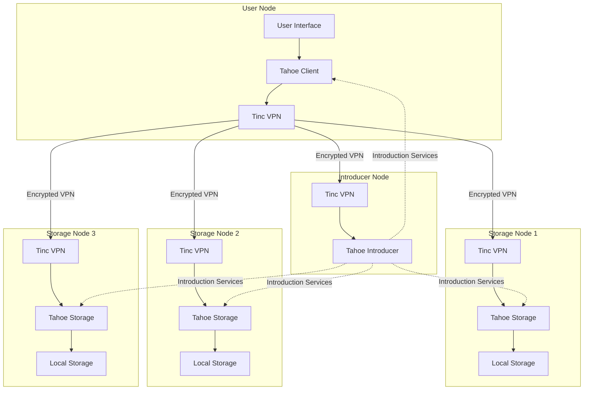

# Project Earthgrid - Distributed Storage Network

Project Earthgrid is a distributed, encrypted storage system built on a secure mesh VPN network. It enables users to contribute storage resources to a collective grid while maintaining privacy through end-to-end encryption.

## Version 2 Release

We've completely redesigned Project Earthgrid with a Docker-based architecture and GPG authentication. The v2 implementation provides a more secure, scalable, and easier-to-deploy network infrastructure.

[**→ View the v2 Documentation**](v2/README.md)

## Architecture Overview

Project Earthgrid creates a cooperative storage grid where participants simultaneously act as both clients and servers. Each node contributes to the network's overall storage capacity and resilience while maintaining the privacy of individual users' data.



### Key Features

- **Decentralized Architecture**: No central authority or single point of failure
- **End-to-End Encryption**: Data is encrypted before leaving the user's device
- **GPG-Based Authentication**: Secure node identity verification
- **Private Networking**: Secure mesh VPN isolates the storage network from the public internet
- **Resource Sharing**: Users contribute resources and benefit from the collective capacity
- **Containerized Deployment**: Easy setup with Docker Compose

## Getting Started

### Prerequisites

- Docker and Docker Compose installed
- Git installed
- GPG installed (for key management)
- Basic understanding of Linux and networking

### Quick Start

1. **Clone the repository**:
   ```bash
   git clone https://github.com/adefilippo83/project-earthgrid.git
   cd project-earthgrid
   ```

2. **Use the setup script**:
   ```bash
   cd v2
   ./setup.sh
   ```

   This script will:
   - Generate GPG keys if needed
   - Configure your node
   - Set up Docker containers
   - Connect to the Earthgrid network

### Manual Setup

For detailed manual setup instructions, see the [v2 documentation](v2/README.md).

## Core Components

1. **Tinc VPN Mesh Network**: Secure communication layer between nodes
2. **GPG Authentication System**: Node identity and authentication using GPG keys
3. **Manifest-Based Configuration**: Centralized configuration management via Git
4. **Auto-Discovery Mechanism**: Nodes automatically discover and connect to each other
5. **Tahoe-LAFS Integration** (Coming Soon): Distributed storage with erasure coding

## Documentation

- [Main v2 Documentation](v2/README.md)
- [GPG Key Management](v2/docs/GPG-KEY-MANAGEMENT.md)
- [Node Deployment Guide](v2/docs/NODE-DEPLOYMENT.md)
- [Design Document](Design_doc.md)

## Development

To contribute to Project Earthgrid:

1. Fork the repository
2. Create a feature branch
3. Implement your changes
4. Test using the provided test scripts
   ```bash
   cd v2/Docker
   ./test-container.sh
   ```
5. Submit a pull request

## License

This project is licensed under the GPL License - see the [LICENSE](LICENSE) file for details.