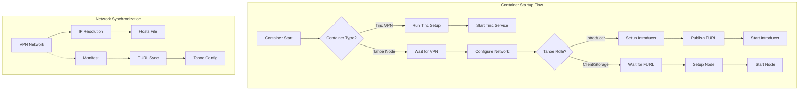
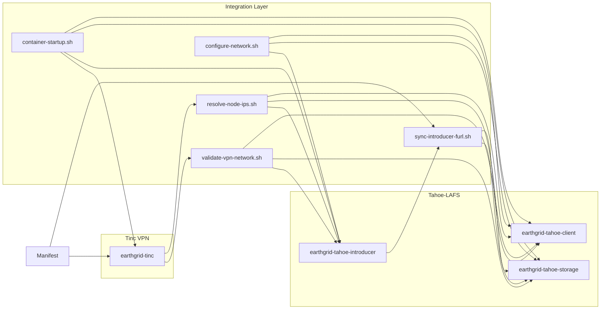

# EarthGrid Integration Scripts

This directory contains scripts that integrate the Tinc VPN and Tahoe-LAFS components of Project Earthgrid. These scripts ensure proper communication, synchronization, and orchestration between the containers.

## Overview

The integration between Tinc VPN and Tahoe-LAFS is critical for the functioning of Project Earthgrid. These scripts handle:

1. Network validation and configuration
2. Name-to-IP resolution within the VPN
3. Introducer FURL synchronization
4. Container startup sequencing

## Architecture



## Scripts

### 1. `validate-vpn-network.sh`

Validates that the Tinc VPN network is properly configured and accessible before letting Tahoe-LAFS containers start their services.

**Features:**
- Checks VPN interface status
- Verifies connectivity to other nodes
- Performs retries with configurable timeout
- Creates a status file for other containers to check

### 2. `resolve-node-ips.sh`

Resolves node names to VPN IP addresses using the network manifest.

**Features:**
- Reads the manifest file to extract node-to-IP mappings
- Updates /etc/hosts with VPN IP entries
- Provides utilities for other scripts to translate names to IPs
- Handles domain name resolution within the VPN

### 3. `configure-network.sh`

Common network configuration script for all containers.

**Features:**
- Sets up common network environment variables
- Ensures VPN is properly configured
- Resolves node IP addresses
- Makes network information available to Tahoe services

### 4. `sync-introducer-furl.sh`

Synchronizes the Tahoe-LAFS introducer FURL to/from the network manifest.

**Features:**
- For introducers: Extracts FURL and updates manifest
- For clients/storage: Gets FURL from manifest and updates configuration
- Handles FURL rotation and updates
- Maintains a local cache of the FURL

### 5. `container-startup.sh`

Manages startup sequence of containers in the appropriate order.

**Features:**
- Handles proper startup order of containers
- Waits for dependencies to be ready
- Initiates network configuration before Tahoe-LAFS services start
- Can be used as entrypoint for Tahoe-LAFS containers

## Usage

These scripts should be integrated into the container entrypoints and referenced in the Docker Compose configuration. For example:

1. For Tinc VPN container:
   ```yaml
   earthgrid-tinc:
     # ... other configuration ...
     entrypoint: ["/usr/local/bin/container-startup.sh"]
     environment:
       - CONTAINER_TYPE=tinc
   ```

2. For Tahoe-LAFS containers:
   ```yaml
   earthgrid-tahoe-client:
     # ... other configuration ...
     entrypoint: ["/usr/local/bin/container-startup.sh"]
     environment:
       - CONTAINER_TYPE=client
     volumes:
       - ./earthgrid-integration/scripts:/usr/local/lib/earthgrid/integration
   ```

## Environment Variables

| Variable | Description | Default |
|----------|-------------|---------|
| `NODE_NAME` | Name of this node | `node1` |
| `CONTAINER_TYPE` | Type of container (`tinc`, `client`, `storage`, `introducer`) | `unknown` |
| `MANIFEST_DIR` | Directory containing manifest file | `/var/lib/earthgrid/manifest` |
| `STARTUP_TIMEOUT` | Maximum time to wait for dependencies (seconds) | `180` |
| `HEALTHCHECK_INTERVAL` | Interval between health checks (seconds) | `5` |
| `DEBUG` | Enable debug logging | `false` |

## Integration Diagram

