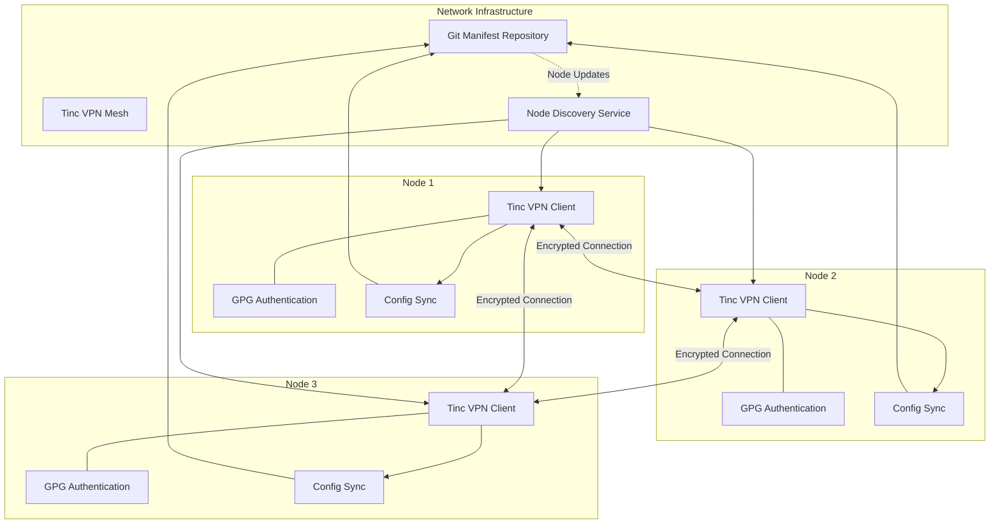
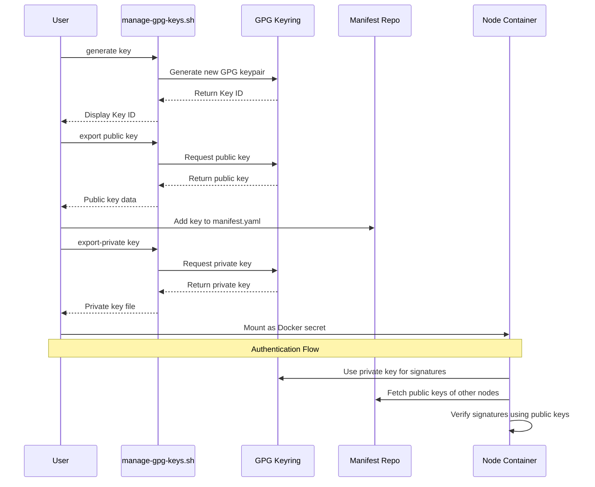
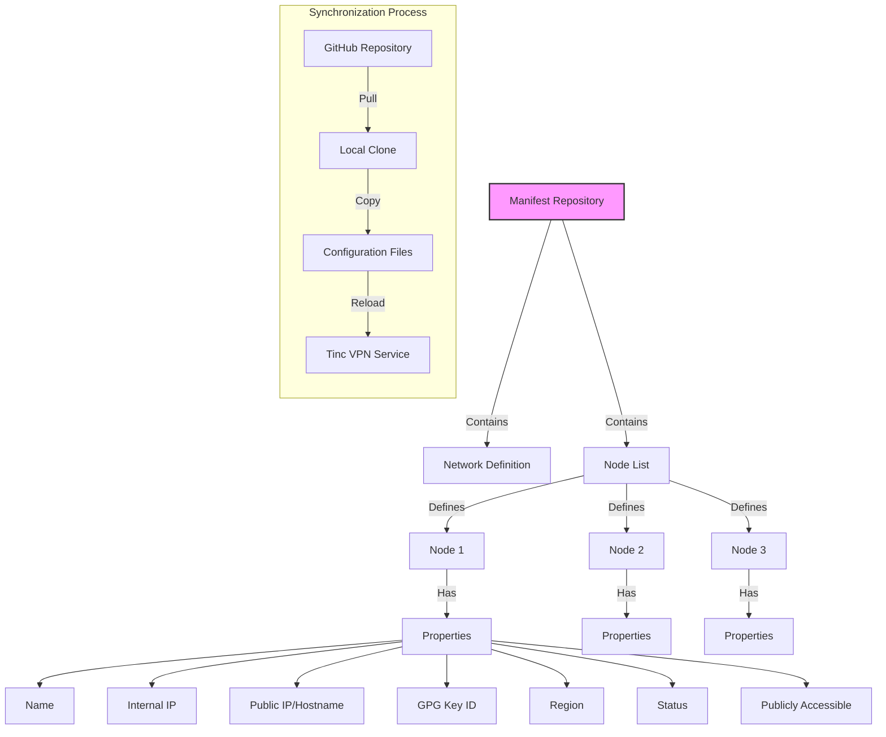

# Project Earthgrid v2 - Distributed Storage Network

This is the V2 implementation of Project Earthgrid, a distributed, encrypted storage system built on Tinc VPN for secure mesh networking. This version implements the network infrastructure and security components described in the design document.

## Architecture Overview

Project Earthgrid creates a cooperative storage grid where participants simultaneously act as both clients and servers. Each node contributes to the network's overall storage capacity and resilience while maintaining the privacy of individual users' data.



- **Decentralized Architecture**: No central authority or single point of failure
- **End-to-End Encryption**: Data is encrypted before leaving the user's device
- **GPG-Based Authentication**: Secure node authentication using GPG keys
- **Private Networking**: Secure mesh VPN isolates the storage network from the public internet

## Components

This implementation includes:

1. **Tinc VPN Mesh Network**: Secure communication layer between nodes
2. **GPG Authentication System**: Node identity and authentication using GPG keys
3. **Manifest-Based Configuration**: Centralized configuration management via Git
4. **Auto-Discovery Mechanism**: Nodes automatically discover and connect to each other

## Getting Started

### Prerequisites

- Docker and Docker Compose installed
- Git installed
- GPG installed (to manage keys)
- Basic understanding of Linux and networking

### Quick Start

1. **Clone the repository**:
   ```bash
   git clone https://github.com/example/project-earthgrid.git
   cd project-earthgrid/v2
   ```

2. **Generate a GPG key pair** (if you don't already have one):
   ```bash
   cd Docker/earthgrid-tinc
   ./scripts/manage-gpg-keys.sh generate "Your Name" "your.email@example.com"
   ```

3. **Export your private key** for Docker secrets:
   ```bash
   mkdir -p ../secrets
   ./scripts/manage-gpg-keys.sh export-private YOUR_KEY_ID ../secrets/gpg_private_key.asc
   ```

4. **Create an environment file** for Docker Compose:
   ```bash
   cd ..
   cat > .env << EOF
   NODE_NAME=your-node-name
   INTERNAL_VPN_IP=10.100.1.X  # Choose an unused IP from manifest.yaml
   GPG_KEY_ID=YOUR_KEY_ID
   GITHUB_REPO=your-username/earthgrid-config
   EOF
   ```

5. **Start the containers**:
   ```bash
   docker-compose up -d
   ```

### Joining the Network

To join an existing Earthgrid network:

1. **Fork the network repository** that contains the manifest
2. **Add your node to the manifest.yaml** file
3. **Generate a GPG key pair** and add your GPG key ID to the manifest
4. **Create a pull request** to the main repository
5. **Deploy your node** using Docker Compose as described above

## Container Details

```mermaid
graph TD
    subgraph "Docker Environment"
        subgraph "earthgrid-tinc Container"
            TC[Tinc VPN] --- TS[Sync Daemon]
            TS --- TG[GPG Auth Module]
            TC --- TG
        end
        
        subgraph "earthgrid-ui Container"
            UI[Web Interface] --- API[Management API]
        end
    end
    
    subgraph "Host System"
        V1[/etc/tinc Volume] --- TC
        V2[GPG Keyring Volume] --- TG
        V3[Manifest Volume] --- TS
        UI --- V4[UI Data Volume]
    end
    
    Internet((Internet)) --- TC
    
    classDef container fill:#e6f3ff,stroke:#333,stroke-width:1px;
    classDef volume fill:#f9e79f,stroke:#333,stroke-width:1px;
    
    class TC,TS,TG,UI,API container;
    class V1,V2,V3,V4 volume;
```

### Tinc VPN Container

The Tinc VPN container (`earthgrid-tinc`) is the core networking component:

- Establishes encrypted mesh connections between nodes
- Authenticates connections using GPG signatures
- Synchronizes configuration from the centralized manifest
- Auto-discovers other nodes in the network

Configuration:
- Environment variables in the Docker Compose file
- GPG key for node authentication
- Tinc configuration files in the volume mount

### Network Management UI (Optional)

The optional UI container (`earthgrid-ui`) provides:

- Network status monitoring
- Node management interface
- Configuration management

## GPG Key Management



GPG keys are central to the security model:

1. **Generating keys**:
   ```bash
   ./scripts/manage-gpg-keys.sh generate "Node Name" "node@example.com"
   ```

2. **Exporting public key** (to add to the manifest repository):
   ```bash
   ./scripts/manage-gpg-keys.sh export YOUR_KEY_ID
   ```

3. **Exporting private key** (for your node's Docker secret):
   ```bash
   ./scripts/manage-gpg-keys.sh export-private YOUR_KEY_ID /path/to/save/key.asc
   ```

## Manifest Configuration



The manifest file (`manifest/manifest.yaml`) defines all nodes in the network:

```yaml
nodes:
  - name: node1
    internal_ip: 10.100.1.1
    public_ip: auto  # or a specific IP or hostname
    gpg_key_id: ABC123456789DEF  # Your GPG key ID
    region: eu-west
    status: active
    is_publicly_accessible: true  # Set to true if the node has a public IP
```

## Troubleshooting

### Checking VPN Status

```bash
docker exec earthgrid-tinc tinc -n earthgrid info
```

### Viewing Logs

```bash
docker logs earthgrid-tinc
```

### Common Issues

1. **Nodes can't connect**: 
   - Verify GPG keys are correct in the manifest
   - Check if at least one publicly accessible node is available
   - Ensure ports are not blocked by firewalls

2. **GPG verification fails**:
   - Make sure your key is properly exported and added to the manifest
   - Check if the key is available on public key servers

3. **Network discovery issues**:
   - Verify the manifest synchronization is working
   - Check if the GitHub repository is accessible

## Security Considerations

- All traffic between nodes is encrypted using Tinc VPN
- Node authentication is secured with GPG signatures
- The manifest repository should be protected with access controls
- Private keys should be kept secure and never shared

## Advanced Configuration

For advanced configuration options, edit the Docker Compose environment variables:

```yaml
environment:
  - NODE_NAME=${NODE_NAME:-node1}
  - INTERNAL_VPN_IP=${INTERNAL_VPN_IP:-10.100.1.1}
  - PUBLIC_IP=${PUBLIC_IP:-auto}
  - GPG_KEY_ID=${GPG_KEY_ID}
  - GITHUB_REPO=${GITHUB_REPO:-earthgrid/config}
  - GITHUB_BRANCH=${GITHUB_BRANCH:-main}
  - MANIFEST_FILENAME=${MANIFEST_FILENAME:-manifest.yaml}
  - ENABLE_AUTO_DISCOVERY=${ENABLE_AUTO_DISCOVERY:-true}
  - SYNC_INTERVAL=${SYNC_INTERVAL:-3600}
```

## Next Steps

Future development will include:

1. Integration with Tahoe-LAFS for distributed storage
2. Web interface for file management
3. Mobile client applications
4. Advanced storage allocation and quota management

## License

This project is licensed under the GPL License - see the LICENSE file for details.