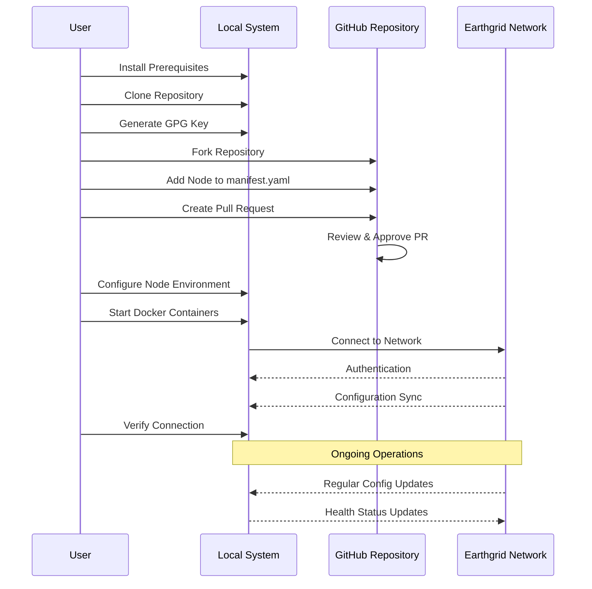

# Node Deployment Guide for Project Earthgrid

This guide provides step-by-step instructions for deploying a new node to the Project Earthgrid network.



## Prerequisites

Before you begin, ensure you have:

- A Linux system or Raspberry Pi with Docker and Docker Compose installed
- Git installed
- GPG installed for key management
- Internet connectivity
- Minimum hardware requirements:
  - 1GB RAM
  - 1 CPU core
  - 20GB storage for the operating system
  - Additional storage for the Earthgrid network contribution

## Deployment Steps

### 1. Clone the Repository

```bash
git clone https://github.com/example/project-earthgrid.git
cd project-earthgrid/v2
```

### 2. Create a GPG Key Pair

If you don't already have a GPG key:

```bash
cd Docker/earthgrid-tinc
./scripts/manage-gpg-keys.sh generate "Your Node Name" "your.email@example.com"
```

Note the key ID displayed in the output. You'll need this for the next steps.

### 3. Export Your GPG Key

Export your public key to add to the manifest:

```bash
./scripts/manage-gpg-keys.sh export YOUR_KEY_ID
```

Export your private key for Docker secrets:

```bash
mkdir -p ../secrets
./scripts/manage-gpg-keys.sh export-private YOUR_KEY_ID ../secrets/gpg_private_key.asc
```

### 4. Add Your Node to the Manifest

1. Fork the manifest repository (if it's separate from the main project)
2. Edit the manifest/manifest.yaml file to add your node:

```yaml
nodes:
  - name: your-node-name
    internal_ip: 10.100.1.X  # Choose an unused IP
    public_ip: auto  # Or specify your public IP/hostname
    gpg_key_id: YOUR_KEY_ID
    region: your-region
    status: active
    storage_contribution: 1TB
    storage_allocation: 300GB
    is_publicly_accessible: true  # Set to true if you have a public IP
```

3. Create a pull request to the main repository
4. Wait for approval from a network administrator

### 5. Configure Your Node

Create a `.env` file in the `v2/Docker` directory:

```bash
cd ..
cat > .env << EOF
NODE_NAME=your-node-name
INTERNAL_VPN_IP=10.100.1.X  # Same as in manifest.yaml
GPG_KEY_ID=YOUR_KEY_ID
GITHUB_REPO=org/earthgrid-config  # Repository containing the manifest
EOF
```

### 6. Deploy the Container Stack

```bash
docker-compose up -d
```

### 7. Verify Your Node is Connected

Check the status of your node:

```bash
docker logs earthgrid-tinc
```

You should see logs indicating successful connection to other nodes in the network.

Verify the VPN connection:

```bash
docker exec earthgrid-tinc tinc -n earthgrid dump nodes
```

### 8. Configure Automated Updates

The Tinc container will automatically sync with the manifest repository every hour by default. To change this interval:

```bash
# Edit .env to add:
SYNC_INTERVAL=3600  # Time in seconds (default: 3600 = 1 hour)
```

Then restart the container:

```bash
docker-compose up -d
```

## Raspberry Pi Deployment Tips

When deploying on a Raspberry Pi:

1. **Use a reliable SD card** or preferably boot from USB/SSD for better reliability
2. **Enable USB boot** if using external storage
3. **Ensure adequate cooling** for the Raspberry Pi
4. **Use a UPS** if possible to prevent corruption from power loss
5. **Set a static IP** on your local network
6. **Configure remote access** via SSH

## Network Configuration

For optimal performance:

1. **Port forwarding**: If possible, forward port 655 (TCP and UDP) to your node
2. **Set up QoS**: Prioritize VPN traffic on your router
3. **Use wired connection**: Ethernet is more reliable than Wi-Fi
4. **Check for double NAT**: May require additional configuration

## Troubleshooting

### Container Won't Start

Check the logs:
```bash
docker logs earthgrid-tinc
```

Common issues:
- Missing GPG key
- Invalid environment variables
- Permission problems with mounted volumes

### Can't Connect to Network

Verify:
1. Your node is in the manifest and approved
2. Your GPG key is correct
3. You can reach at least one public node
4. Port 655 is not blocked by firewalls

### GPG Verification Issues

If other nodes can't verify your identity:
1. Ensure your public key is uploaded to key servers
2. Check if your key ID in the manifest is correct
3. Try re-exporting and re-importing your keys

## Maintenance

### Updating the Container

To update to the latest version:

```bash
cd project-earthgrid/v2
git pull
docker-compose pull
docker-compose up -d
```

### Backing Up Configuration

Backup important files:

```bash
cp -r Docker/data/gnupg /backup/gnupg
cp -r Docker/data/tinc /backup/tinc
cp Docker/secrets/gpg_private_key.asc /backup/
```

### Monitoring

Monitor your node's status:

```bash
# Check CPU and memory usage
docker stats earthgrid-tinc

# Check disk usage
df -h

# Check network connections
docker exec earthgrid-tinc netstat -tunap
```

## Security Best Practices

1. **Keep your system updated**: Regular OS and Docker updates
2. **Secure SSH access**: Use keys instead of passwords, change default port
3. **Use a firewall**: Only open necessary ports
4. **Monitor logs**: Check for unusual activity
5. **Backup your keys**: Store securely but accessible in case of hardware failure

## Next Steps

Once your node is running:

1. Verify it appears in the network status
2. Begin contributing storage (future implementation)
3. Configure storage allocation

## Getting Help

If you encounter issues:

1. Check the documentation
2. Review logs and error messages
3. Search the project issues on GitHub
4. Reach out to the community on the project forum or chat